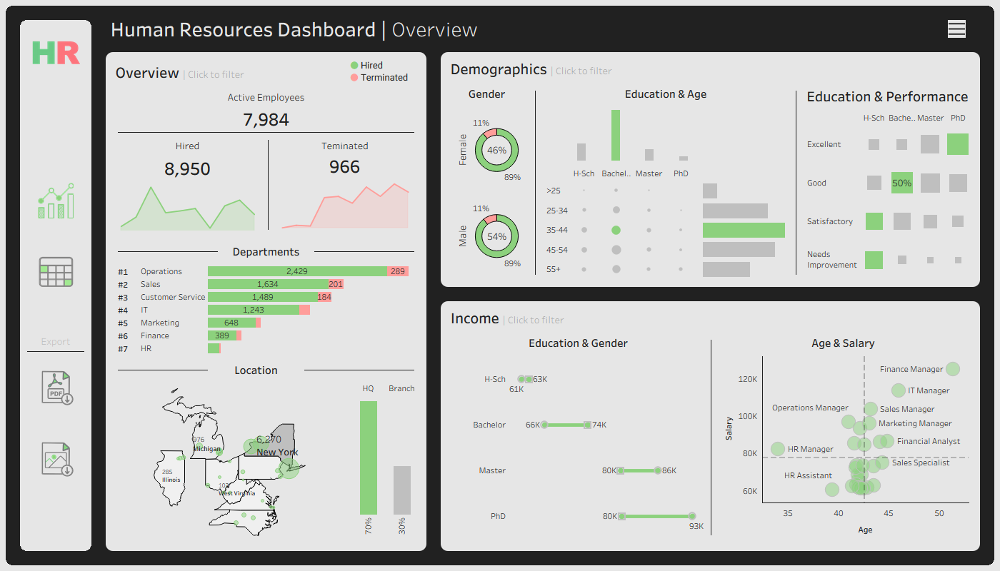
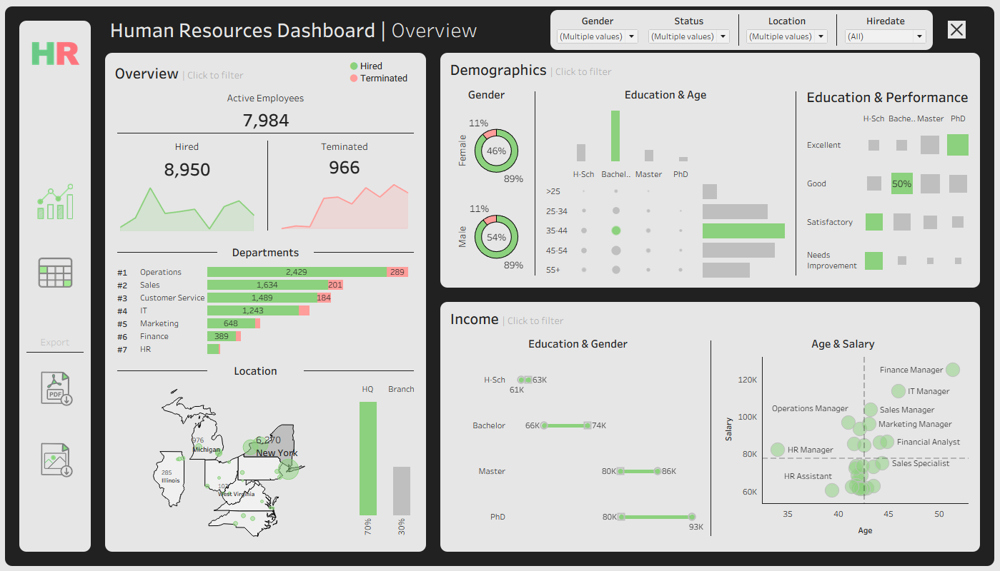
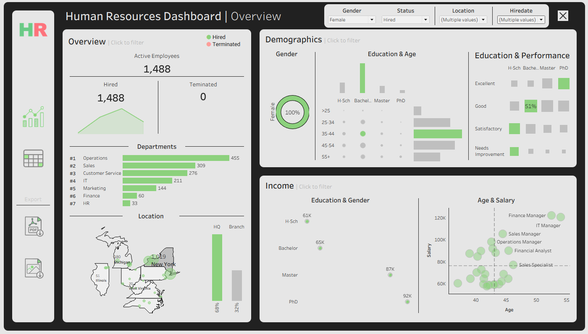
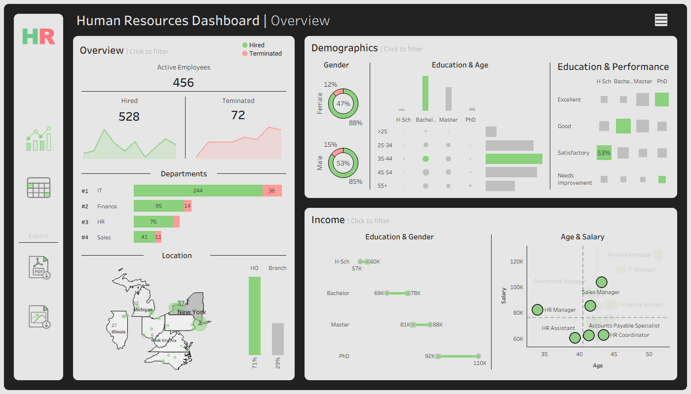
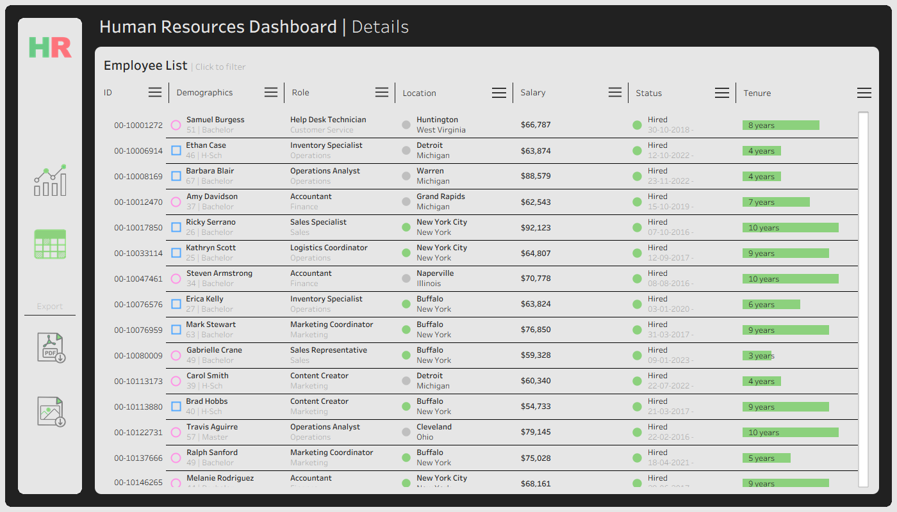
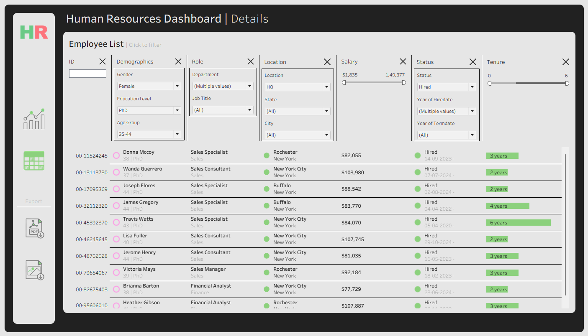

# HR Analytics Dashboard

This project presents an interactive **HR Analytics Dashboard** developed using Tableau for workforce reporting, employee analysis, and organizational insights.

The project is designed as a portfolio project showcasing:

* HR analytics and workforce reporting
* Interactive Tableau dashboard development
* Employee demographic and income analysis
* Dashboard interactivity and navigation design
* Data generation and visualization workflows

---

## Dashboard Overview

The project contains two primary dashboards:

### Summary Dashboard

<div align="center">
  
</div>
<br>
The Summary Dashboard provides a high-level summary of workforce metrics, employee demographics, and salary analysis.

It enables users to monitor employee hiring and termination trends, analyze workforce distribution across departments and locations, evaluate demographic composition, and compare salary patterns across education levels, age groups, and departments.

The dashboard supports interactive analysis through cross-filtering and dashboard-wide updates based on user selections.

### Details Dashboard

<div align="center">
  
</div>
<br>
The Details Dashboard provides employee-level reporting and detailed workforce analysis.

It enables users to explore employee information such as ID, demographics, position, geographics, salary, and tenure through an interactive records view with dynamic employee-level filtering and detailed workforce analysis.

---

## Dashboard Features

### Interactive Features
- Dashboard-wide dynamic filtering and interactive analysis
- Cross-filtering between dashboard visualizations that update the entire dashboard
- Dynamic updates across charts, KPIs, and employee records based on user interaction

### Navigation & Controls
- Navigation buttons for switching between dashboards
- Toggle buttons for showing and hiding filters
- Export buttons for downloading dashboards as PDF or image files
- Custom icons used for dashboard controls and navigation

### Filters

The dashboards support dynamic filtering, allowing users to analyze workforce data across multiple employee, demographic, and organizational dimensions.

#### Overview Dashboard Filters
- Gender
- Status
- Location
- Hiredate

<div align="center">
Before Filter Selection
<br>
  
<br>
<sub>
No filters applied
</sub>
</div>
<br>

<div align="center">
After Filter Selection
<br>
  
<br>
<sub>
Gender: Female |
Status: Hired |
Location: All |
Hiredate: 2021 ~ 2024 |
</sub>
</div>
<br>

<div align="center">
Interactive Dashboard Filtering
<br>
  
<br>
<sub>
Dashboard-wide updates based on selected Age & Salary Chart
</sub>
</div>

#### Details Dashboard Filters
Multiple employee-level filters across more than 13 dimensions

<div align="center">
Before Filter Selection
<br>
  
<br>
<sub>
No Filter applied
</sub>
</div>
<br>

<div align="center">
After Filter Selection
<br>
  
<br>
<sub>
Gender: Female |
Education Level: PhD |
Age Group: 35-44 |
Department: Finance, HR, Operations, Sales |
Job Title: All |
Location: HQ |
State: All |
City: All |
Salary: All |
Status: Hired |
Hiredate: 2020 ~ 2024 |
Tenure: All |
</sub>
</div>

---

## Repository Structure
```
hr-analytics-dashboard/
│
├── data-generation/                    # Program for dataset generation
│   └── generate_data   .py
│
├── datasets/                           # Source datasets used for dashboard development
│   └── dataset.csv
│
├── images/                             # Dashboard screenshots and icons used in the project
│
├── hr-dashboard.twbx                   # Tableau packaged workbook containing dashboards and visualizations
│
├── README.md                         	# Project overview and instructions
├── LICENSE                             # License information for the repository
└── .gitignore                          # Files and directories to be ignored by Git
```
---

## [Tableau Public Dashboard](https://public.tableau.com/app/profile/chiraggh/viz/HRDashboard_17784344141840/SummaryDashboard)

---

## License

This project is licensed under the [MIT License](LICENSE). You are free to use, modify, and share this project with proper attribution.

---